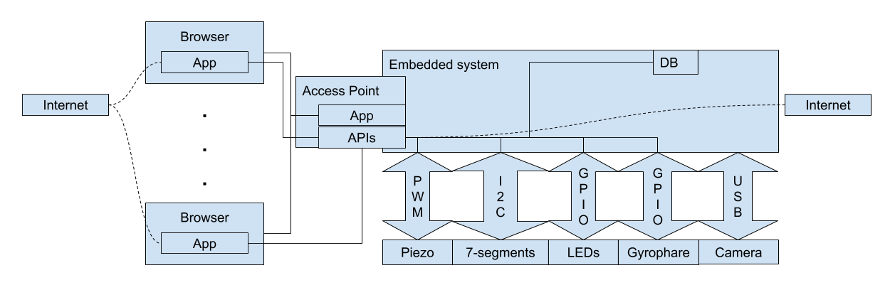

# devfest-embedded-devices-monorepo

The monorepo to manage embedded devices we put in each room during the DevFest Toulouse, the devices are here to assist us during the event.

This project is actively developped by the DevFest Toulouse's organizers and by students of the Epitech Toulouse, this is a common project between the two structures (cf. [HUB project description](./docs/miscellaneous/epitech-project-description.md)).

## Features

### Countdown for speakers

The first goal of this project is to be able to inform speakers about the time left for their current talk. As organizers we also want to be able to monitor the time left in each room and eventually to adapt them in order to have a better crowd moves management.

### Faces counter

The second milestone will be to be able to estimate the number of people in the room, according to the data we sense in each of them (camera, sound, etc.)

## Architecture

[Here](./docs/architecture/general-schema.png) is a global schema of the architecture:

## Technologies

- [Angular](https://github.com/angular/angular)
- [Angular Material](https://github.com/angular/components)
- [Bash](http://git.savannah.gnu.org/cgit/bash.git) & [Ash - Busybox](https://git.busybox.net/busybox/)
- [Bitbake](https://github.com/openembedded/bitbake) & [Poky](https://github.com/jku/poky)
- [CouchDB](https://github.com/apache/couchdb)
- [Docker](https://github.com/docker/docker-ce)
- [Kubernetes](https://github.com/kubernetes/kubernetes)
- [K3s](https://github.com/rancher/k3s)
- [Nest.js](https://github.com/nestjs/nest)
- [Nginx](https://github.com/nginx/nginx)
- [Node.js](https://github.com/nodejs/node)
- [Nx](https://github.com/nrwl/nx)
- [OpenCV](https://github.com/opencv/opencv)
- [PouchDB](https://github.com/pouchdb/pouchdb)
- [Qemu](https://github.com/qemu/qemu)

## Run the project

### Platforms

The project is currently developped and tested under the following platforms (do not hesitate to contribute, adding the platform you use and submitting issues under your platform in case of troubles).

#### Ubuntu 18.04

- Node.js (version `13.11.0`)
- NPM (version `6.14.1`)
- Python (version `3.7.3`)
- Yarn (version `1.21.1`)

### Development

Use NPM build scripts provided in the [package.json](./package.json) to run the parts you want to develop on (like `yarn run back:nest:cloud`).

The development architecture is described [here](./docs/architecture/dev-cluster.drawio):

## Package

